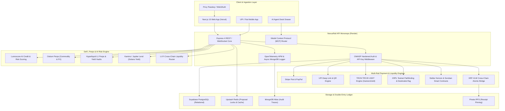

# NexusRail Super-Platform: Master Combined Ecosystem Architecture

## Executive Summary
**NexusRail** is the unified enterprise commerce, fintech, Web3, and AI agent super-platform. It synthesizes the specialized architectures of **Spectrum**, **GamersGold**, **Lumoscore**, **Mento**, **XRP-XLM Bridge**, **UPI Payment**, and **Ostium Perps** into a single cohesive, production-ready monorepo stack.

---

## Combined Subsystem Deep-Dive

### 1. Spectrum Subsystem (Solana DeFi, Ostium Perps, LI.FI & MCP)
* **Kamino & Jupiter Lending**: Yield optimization and automated collateral routing for merchant reserves.
* **Ostium Protocol (`@ostium/builder-sdk`)**: Real-world commodity (Gold, Oil) and FX perpetual futures trading.
* **LI.FI Cross-Chain Bridge (`@lifi/sdk`)**: Any-token to any-token settlement across EVM & Solana.
* **Model Context Protocol (MCP)**: AI agents dynamically register tool capabilities (`get_market_stats`, `open_perp_position`, `verify_yield_vault`).
* **ZkLighter Orderbook (`zklighter-sdk`)**: High-frequency zero-knowledge orderbook matching.

### 2. GamersGold Subsystem (TRON USDT, Tournament Escrow & OpenTelemetry)
* **TRON TRC20 Payment Engine (`tronweb`)**: Sub-cent transaction fee crypto checkout for gaming items & micro-transactions.
* **Tournament Escrow Ledger**: Locked prize pool accounts with release conditions verified by AI agents.
* **OpenTelemetry APM Tracing**: Distributed tracing across express micro-services with OTLP HTTP exporters.
* **PayPal Checkout Integration**: Alternative fiat checkout option alongside Stripe.
* **Agenda / Node-Cron Scheduled Workers**: Automated periodic vault points accrual and withdrawal price sync.

### 3. Lumoscore Subsystem (AI Risk Engine, Turnkey Vaults & XRPL Pathfinding)
* **AI Credit & Risk Underwriting**: Algorithmic scoring of wallet transactions, liquidity depth, and user trust factors.
* **Turnkey Hardware Security (`@turnkey/sdk-server`)**: Non-custodial server-side key management and passkey signing.
* **XRPL Pathfinding & SendMax**: Algorithmic payment path routing on XRP Ledger (`ripple_path_find`).
* **Xumm Mobile QR SDK (`xumm-sdk`)**: One-click mobile wallet transaction authorization via QR code scan.

### 4. XRP-XLM Cross-Chain Bridge Subsystem
* **Soroban Smart Contracts**: Atomic hash time-locked contracts (HTLC) bridging XRP Ledger and Stellar Horizon networks.
* **Trustline & Asset Verification**: Automated repair and validation of TOML specs and asset issuer locks.

### 5. UPI Payment Subsystem (Fiat Indian Instant Settlement)
* **UPI Deep Link Generator**: Instant mobile payment execution (`upi://pay?pa=...&pn=NexusRail&am=...`).
* **Dynamic QR Code Engine**: Generates real-time UPI QR codes with order ID embedding and webhook payment confirmation.

### 6. Mento Subsystem (Social Commerce & Governance)
* **Head-to-Head Product Showdowns**: Community-driven product battlecards with live percentage voting.
* **Verified Buyer Upvotes & Leaderboard**: Anti-sybil buyer verification using wallet transaction history.
* **Celo-Mento Stablecoins**: cUSD / cEUR settlement options.

---

## Unified Monorepo Feature Matrix

| Feature Module | Source Ecosystem | Implementation Location | Deployment Platform |
| :--- | :--- | :--- | :--- |
| **Multi-Rail Checkout (Stripe, TRON, XRPL, Stellar, UPI)** | NexusRail + GamersGold + Lumoscore + UPI | `apps/api/src/services/` & `apps/web/src/components/` | Vercel (Web) + Render (API) |
| **Double-Entry Wallet Ledger** | Phase 1 Foundation | `apps/api/src/services/ledger.ts` | Render (API) + Supabase PG |
| **Sub-300ms AI Agent Desk (Groq/Gemini + MCP)** | Phase 3 + Spectrum | `apps/api/src/services/aiRouter.ts` | Render (API) + Redis |
| **Ostium & Hyperliquid Perps Trader** | Spectrum + Ostium | `apps/api/src/services/perps.ts` | Render (API) |
| **Lumoscore AI Credit Risk Evaluator** | Lumoscore | `apps/api/src/services/riskScore.ts` | Render (API) |
| **IPFS Order Receipt Pinning** | Lumoscore + Phase 2 | `apps/api/src/services/ipfs.ts` | Pinata IPFS |
| **MongoDB Atlas Telemetry & Traces** | Phase 1 + GamersGold | `apps/api/src/services/mongo.ts` | MongoDB Atlas M0 |
| **Mento Social Showdowns & Reviews** | Mento + Phase 4 | `apps/web/src/components/ProductShowdownCard.tsx` | Vercel (Web) |
| **`fal.ai` Asset Generator & Turnkey Passkeys** | Phase 5 + Spectrum | `apps/web/src/components/PluginsShowcase.tsx` | Vercel (Web) |

---

## Security & Compliance Architecture
* **OWASP API Security Top 10**: Rate-limiting (100 req/min/key), CORS origin locking, and XSS sanitization.
* **Zero-Knowledge Receipts**: Transaction proofs pinned to IPFS with cryptographic hashes.
* **Auditability**: Every AI prompt, proposal lock, and ledger entry is asynchronously logged to MongoDB Atlas (`agent_audit_traces`).
