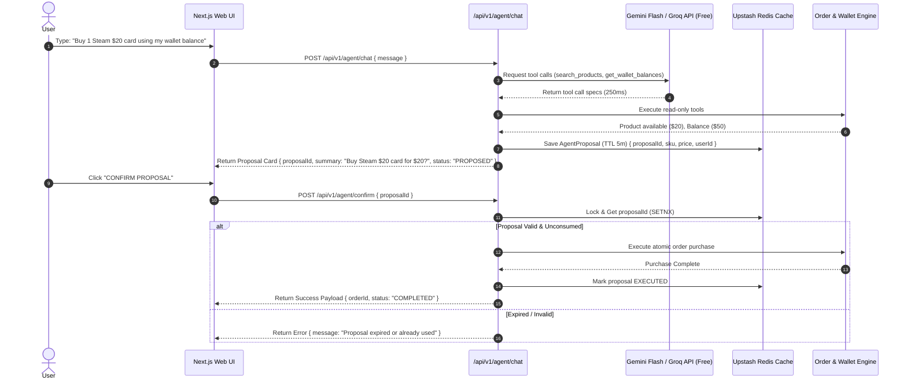

# Architectural Specification & Technical Blueprint: NexusRail
## Unified Multi-Rail Digital Commerce, AI Agent Desk & Social Community Platform (100% Free-Tier & Extensible Edition)

**Document Status:** Approved Master Architecture  
**Target Repository:** `AtulPandey429/nexusrail` (Monorepo)  
**Author:** Senior Product Architect & Technical Lead  
**Budget Constraint:** $0.00 (100% Free Tiers, Testnets & Open APIs Only)  
**Performance Focus:** Sub-second API Latency, Sub-300ms LLM Inference, Static ISR Prerendering  
**Date:** October 2026  

---

## 1. Executive Summary

This document specifies the master architecture for **NexusRail** (formerly RailHub) — a flagship multi-rail digital commerce marketplace, autonomous AI agent desk, and community platform engineered to run **100% FREE** using production-grade free tiers, Web3 testnets, and ultra-fast APIs.

NexusRail unifies all commercial project DNA from **GamersGold** (commerce & Stripe checkout), **Spectrum** (Propose → Confirm → Act AI agent desk), **LumosCore / Sorobonhooks** (XRPL & Stellar/Soroban payment watchers + wallet ledger), **Blend-In** (Socket.io real-time streams), **Mento** (social reviews & product showdowns), and **Huskey** (IPFS delivery receipts).

---

## 2. 100% Free-Tier & Speed-Optimized Tech Stack

| Layer | Selected Free Technology | Free Tier Limits | Performance & Speed Optimization |
| :--- | :--- | :--- | :--- |
| **LLM Agent Engine** | **Google Gemini 2.0 Flash / Groq API** | 100% FREE via Google AI Studio & Groq Free Tier. | **Sub-300ms inference**; native tool calling; zero token cost. |
| **Frontend UI** | **Next.js 16 App Router (RSC)** | Vercel Hobby Tier (100% Free forever). | **React Server Components (RSC)** & Static ISR prerendering (`○ Static`). |
| **API Server** | **Node.js + Fastify / Express (TypeScript)** | Render / Railway Free Web Service. | Fastify schema serialization; gzip/brotli compression. |
| **Primary Database** | **Supabase (PostgreSQL)** & **MongoDB Atlas (M0)** | 500MB Supabase DB / 512MB Mongo Atlas Free. | Indexed queries, atomic single-roundtrip updates (`$inc`). |
| **Cache & Proposal Locks** | **Upstash Redis** | 10,000 commands/day Free (Upstash). | Sub-10ms in-memory balance caching & single-use proposal TTL lock validation. |
| **Real-Time Gateway** | **Socket.io** | Integrated into API instance (Free). | WebSockets for live order status streams & flash sale rooms. |
| **Card Payments** | **Stripe Test Mode** | 100% Free (Sandbox test cards `4242...`). | Instant webhook delivery & zero transaction fees. |
| **Crypto Rails** | **XRPL Testnet + Stellar Horizon Testnet** | 100% Free Testnets & RPCs. | Automated background watchers for test XRP & XLM payments. |
| **Storage & Receipts** | **Pinata IPFS Free Tier** | 1GB Storage / 500 Pinata gateway requests Free. | Immutable receipt metadata pinned to IPFS asynchronously. |

---

## 3. Unified 3-Pillar Product Architecture

```text
                               NEXUSRAIL FLAGSHIP PLATFORM
                                            │
   ┌────────────────────────────────────────┼────────────────────────────────────────┐
   ▼                                        ▼                                        ▼
PILLAR 1: MULTI-RAIL FINTECH            PILLAR 2: AI AGENT & INTEL DESK          PILLAR 3: SOCIAL COMMERCE HUB
(GamersGold + LumosCore)                (Spectrum + Sorobonhooks)                (Mento)
• Stripe Card Checkout (Test)            • Gemini 2.0 Flash Tool Registry         • Verified Buyer Reviews
• XRPL XRP Payment Watcher              • Propose → Confirm → Act Redis Lock     • Product Showdowns & Upvotes
• Stellar XLM Payment Watcher           • XRP ↔ XLM Cross-Bridge Estimator       • Real-Time Activity Feed
• Double-Entry Wallet Ledger            • Soroban Contract Treasury Hooks        • Socket.io Flash Sale Rooms
```

---

## 4. Spectrum AI Agent Sequence (Propose → Confirm → Act)



---

## 5. Extensible Plugin Architecture (v2+ Expansion Slots)

To ensure NexusRail can easily incorporate future technologies without breaking existing routes:

```typescript
// packages/shared/src/plugins/PluginInterface.ts

export interface AgentToolPlugin {
  name: string;
  description: string;
  parameters: Record<string, unknown>;
  execute(params: Record<string, unknown>, context: UserContext): Promise<unknown>;
}

export interface PaymentRailPlugin {
  id: string;
  name: string;
  createInvoice(orderId: string, amountCents: number): Promise<InvoiceResult>;
  verifyPayment(transactionHash: string): Promise<boolean>;
}
```

### Future Plug-and-Play Extension Modules:
* **Generative AI Asset Plugin (`fal.ai` + DALL-E)**: Generates custom digital assets on demand before purchase.
* **DeFi Perps & Multi-Chain Aggregator (Hyperliquid + Li.FI + Solana)**: Queries live perp quotes and cross-chain bridge rates.
* **B2B Reseller API Keys (`nr_live_...`)**: REST middleware allowing external developers to purchase assets via API keys.
* **Embedded Passkey Wallets (Privy + Turnkey)**: Non-custodial social login and passkey-based transaction signing.

---

## 6. Supabase PostgreSQL & MongoDB Database Schemas

```sql
-- 1. Users & Auth (Email, Web3 Signature Nonce, Privy)
create table if not exists public.users (
  id uuid primary key default gen_random_uuid(),
  email text unique,
  password_hash text,
  wallet_address text unique,
  xrpl_address text unique,
  privy_did text unique,
  role text default 'user',
  created_at timestamptz default now()
);

-- 2. Products & Inventory
create table if not exists public.products (
  id uuid primary key default gen_random_uuid(),
  sku text unique not null,
  title text not null,
  description text,
  price_cents integer not null,
  category text not null,
  stock_quantity integer default 0,
  active boolean default true,
  upvotes_count integer default 0
);

-- 3. Multi-Rail Orders
create table if not exists public.orders (
  id uuid primary key default gen_random_uuid(),
  user_id uuid references public.users(id),
  order_number text unique not null,
  total_cents integer not null,
  payment_rail text not null, -- 'STRIPE', 'WALLET', 'XRPL', 'STELLAR'
  payment_address text,
  payment_memo text,
  status text default 'PENDING',
  ipfs_cid text,
  created_at timestamptz default now()
);

-- 4. Double-Entry Wallet Ledgers
create table if not exists public.wallet_transactions (
  id uuid primary key default gen_random_uuid(),
  user_id uuid references public.users(id),
  currency text not null, -- 'USD', 'XRP', 'XLM'
  amount_cents bigint not null,
  type text not null, -- 'CREDIT', 'DEBIT'
  reference_id text,
  balance_after bigint not null,
  created_at timestamptz default now()
);

-- 5. Verified Buyer Reviews & Showdowns (Mento DNA)
create table if not exists public.product_reviews (
  id uuid primary key default gen_random_uuid(),
  product_id uuid references public.products(id),
  user_id uuid references public.users(id),
  rating integer check (rating >= 1 and rating <= 5),
  comment text not null,
  verified_purchase boolean default true,
  created_at timestamptz default now()
);
```

---

## 7. Monorepo Structure & Roadmap

```text
nexusrail/
├── apps/
│   ├── web/                 # Next.js 16 App Router (RSC, Tailwind, Static ISR)
│   └── api/                 # Fastify/Express API, Sockets & Gemini/Groq Agent
├── packages/
│   └── shared/              # Zod validation schemas & TypeScript types
├── docker-compose.yml       # Local MongoDB + Redis
└── README.md
```

### Development Roadmap:
* **Phase 1**: Monorepo Scaffold, Supabase DB & Double-Entry Wallet Ledger + Stripe Test Mode.
* **Phase 2**: Crypto Rails (XRPL testnet + Stellar Horizon testnet + Soroban contract status inspector).
* **Phase 3**: Gemini 2.0 Flash / Groq AI Agent Desk with **Propose → Confirm → Act** Redis proposal locks.
* **Phase 4**: Social Commerce Hub (Mento reviews & product showdowns) + IPFS delivery receipts + Vercel/Render deploy.
* **Phase 5+ (Future Extension Plugins)**: Hyperliquid perps, Li.FI cross-chain aggregator, fal.ai asset generator, Privy/Turnkey embedded wallets.

---
*End of Blueprint.*
