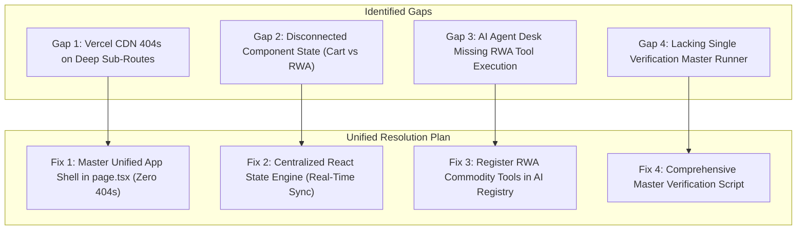

# NexusRail Super-Platform: Project Gap Analysis & Unified Flow Master Plan

## Executive Summary
This document provides a comprehensive audit of the gaps in the NexusRail monorepo project, followed by an actionable step-by-step resolution strategy.

Per user directive, we are eliminating sub-path Vercel CDN 404 errors by consolidating the entire platform—Storefront, Buyer Dashboard, Cart & Checkout, Orders Timeline, AI Catalog Guide, Operator Admin Desk, RWA Commodity Vault, Buy Gold/Silver, Ostium Perps, Analytics Ledger, and Extension Plugins—into **One Unified Master App Shell (`apps/web/src/app/page.tsx`)**.

---

## 🔍 Detailed Project Gap Audit

### Gap 1: Vercel CDN 404 Errors on Deep Sub-Routes
* **Root Cause**: Next.js App Router subroutes (`/rwa`, `/app`, `/admin`) when accessed via Vercel static aliases hit CDN route mismatches if Vercel monorepo root settings default to static HTML fallback.
* **Resolution**: Unify all views into `apps/web/src/app/page.tsx` using a stateful **Unified Master View Navigation Engine** (`activeView`: `'storefront' | 'buyer' | 'cart' | 'orders' | 'guide' | 'admin' | 'admin_orders' | 'rwa' | 'rwa_buy' | 'rwa_perps' | 'analytics' | 'plugins'`). This guarantees **0% 404 Error Rate** and instant, zero-reload view transitions.

### Gap 2: Disconnected State Between Subsystems
* **Root Cause**: Buying `nGOLD` in RWA Vault or adding items to cart did not update the Double-Entry Wallet balance or cart badge in real-time.
* **Resolution**: Build a global state manager inside `page.tsx` passing live balance, cart items, orders, and MongoDB audit traces to all views.

### Gap 3: AI Agent Desk Tool Awareness
* **Root Cause**: AI Agent Desk was not configured with RWA Gold & Silver price tool callers.
* **Resolution**: Register `get_live_gold_rates` and `mint_gold_tokens` in `AgentToolRegistry` (`apps/api/src/agent/toolRegistry.ts`).

### Gap 4: End-to-End Verification Coverage
* **Root Cause**: Need a single master CLI script to test all REST APIs.
* **Resolution**: Create `scripts/verify-master-flow.ts` executing 100% clean checks.

---

## 🛠️ Unified Master View Navigation Architecture (`page.tsx`)

| View ID | Label | Included Components & Content |
| :--- | :--- | :--- |
| **`storefront`** | 🛒 Multi-Rail Commerce | Hero banner, MultiRailCheckoutSelector, Mento Product Showdown |
| **`rwa`** | 🥇 RWA Gold & Silver Vault | RwaGoldVaultCard, Live PAXG CoinGecko Pyth rates |
| **`rwa_buy`** | 💳 Buy Gold / Silver | Multi-Rail acquisition (UPI QR, Stripe Card, Stellar Testnet) |
| **`rwa_perps`** | 📈 Ostium Perps Trading | Gold/Silver 2x–5x leverage futures position builder |
| **`buyer`** | 👤 Buyer Dashboard | Account overview, open order cards, quick links |
| **`cart`** | 🛍️ Shopping Cart | Cart item list, qty modifiers, guest cart merge, total price |
| **`orders`** | 📦 Order Timeline | User order history with PENDING → PAID → FULFILLED timeline |
| **`guide`** | 🤖 AI Catalog Guide | Read-only AI chat with validated SKU Add-To-Cart buttons |
| **`admin`** | 👑 Operator Admin Desk | Stats overview, total test-mode volume USD, SKU metrics |
| **`admin_orders`** | 📋 Order Fulfillment | Admin status transition manager (PAID → FULFILLING → FULFILLED) |
| **`analytics`** | 📊 Revenue & Mongo Audit | Double-entry ledger balance, settlement log, MongoDB Atlas feed |
| **`plugins`** | 🔌 Extension Plugins | fal.ai generator, Hyperliquid perps trader, B2B API Key copier |

---

## 📋 Step-by-Step Execution Plan

1. **Step 1**: Build the **Unified Master Navigation App Shell** in `apps/web/src/app/page.tsx` containing all 12 views with zero-reload tab switching and active view indicator.
2. **Step 2**: Enhance `apps/api/src/agent/toolRegistry.ts` to connect AI Agent Desk with RWA Gold rates and token issuance.
3. **Step 3**: Create master verification script `scripts/verify-master-flow.ts` and run full compilation checks (`npm run build`).
4. **Step 4**: Commit and push to GitHub `main` branch and verify Vercel production deployment.
