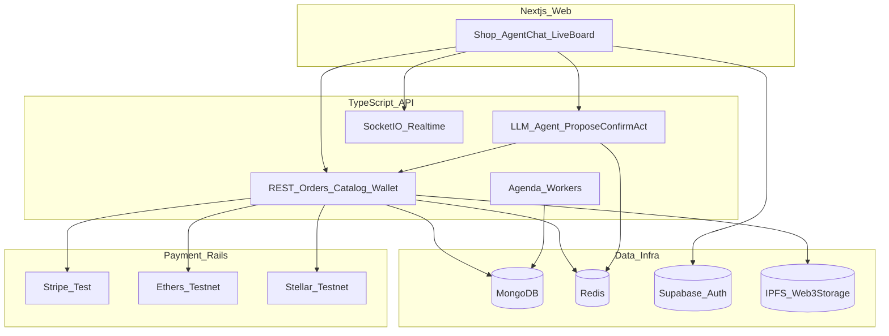

# RailHub — Personal Resume Project Plan

> **Goal:** One public full-stack product that showcases every major skill from AppAvengers production work (LumosCore, Sorobonhooks, Mento, GamersGold, Spectrum, Blend-In, Huskey) — without copying private company code.

| Field | Value |
| --- | --- |
| Product name | **RailHub** |
| Type | Personal / public portfolio project |
| Owner | Atul Pandey (`AtulPandey429`) |
| Repo | New public monorepo (separate from `atul-portfolio`) |
| Resume target | Backend / Full-Stack / Web3 + LLM Agents roles |
| Demo constraint | Stripe **test mode** + chain **testnets** only |

---

## 1. One-liner (resume)

Built **RailHub**, a multi-rail digital marketplace with Stripe/crypto checkout, Redis-backed wallets and orders, Socket.io live updates, and an LLM agent that **proposes → confirms → executes** purchase and wallet actions.

---

## 2. Why this project

Company work already tells one coherent story:

**DeFi backends + gaming commerce + social + LLM agents + realtime.**

A resume project should be **one product** with that same story — not six disconnected demos.

**RailHub** = digital-goods marketplace + agent desk:

| Capability | Company DNA |
| --- | --- |
| Buy digital items / top-ups | GamersGold |
| Stripe + crypto wallets + ledger | GamersGold, LumosCore, Huskey |
| Chat agent (propose → confirm → act) | Spectrum |
| Live order board + flash-sale room | Blend-In, Socket.io |
| Reviews / activity feed | Mento |
| IPFS delivery receipts | Huskey |
| Public Next.js + TypeScript API | Portfolio stack |

---

## 3. Skill → module map

| Production signal | RailHub module | Stack to demonstrate |
| --- | --- | --- |
| **GamersGold** | Catalog, cart, orders, mock supplier, coupons | Express, MongoDB, Redis, Agenda/cron, Stripe, PayPal sandbox |
| **LumosCore / Sorobonhooks** | Wallet ledger, deposit flow, Stellar balance + bridge estimate | TypeScript, Stellar SDK, Redis, Privy demo wallets |
| **Spectrum** | `/api/agent` tool registry | OpenAI tools, Redis proposal sessions, JWT/Privy auth |
| **Mento** | Reviews, comments, activity feed | Supabase Auth + MongoDB |
| **Blend-In** | Live order board + timed flash-sale room | Socket.io + Redis state |
| **Huskey** | Delivery receipts on IPFS | Web3.Storage, JWT |
| **Portfolio** | Public UI + deploy | Next.js, Docker, Vercel, Render |

### Resume-safe limits

- **Mock supplier adapters** only (no real MooGold / G2A / Eneba keys)
- Stripe **test** keys; EVM + Stellar **testnets**
- Do **not** copy private company repos or proprietary integrations
- Do **not** claim real GMV / TVL — label everything as demo

---

## 4. Architecture



### End-to-end flows to ship

1. **Auth** — email (Supabase) + wallet (Privy)
2. **Commerce** — browse → cart → checkout (Stripe or crypto) → `pending → paid → fulfilled`
3. **Wallet** — internal ledger + Redis-cached balances + testnet deposit simulation
4. **Agent** — propose plan → user confirms → tools execute → order created
5. **Realtime** — Socket.io order events + one flash-sale countdown room
6. **Social** — product reviews + simple activity feed
7. **Receipts** — digital delivery metadata on IPFS

---

## 5. Locked tech stack

### Monorepo layout

```text
railhub/
├── apps/
│   ├── web/                 # Next.js App Router, TypeScript, Tailwind
│   └── api/                 # Express + Socket.io + Agenda workers
├── packages/
│   └── shared/              # zod schemas + shared types
├── docker-compose.yml       # mongo + redis (local)
├── Dockerfile               # API image
└── README.md
```

### Choices (v1 — do not expand yet)

| Layer | Choice | Why |
| --- | --- | --- |
| API | TypeScript + **Express** + Socket.io | Matches most company commit volume |
| Web | **Next.js** App Router | Public demo + portfolio fit |
| Primary DB | **MongoDB** Atlas | Orders/catalog like GamersGold/Mento |
| Cache / sessions | **Redis** | Agent proposals, balances, live rooms |
| Auth | **Supabase Auth** + **Privy** | Email + wallet; skip Firebase in v1 |
| Card pay | **Stripe** test mode | GamersGold payment signal |
| Crypto | **Ethers** (EVM testnet) + **Stellar** testnet | LumosCore signal without full multi-chain |
| Jobs | **Agenda** (or node-cron) | Fulfillment + payment watchers |
| Agent | **OpenAI** tool-calling + Redis proposals | Spectrum propose → confirm → act |
| IPFS | **Web3.Storage** | Huskey signal |
| Deploy | Web → **Vercel**, API → **Render/Railway** | Resume-familiar DevOps |

### Stretch only (Phase 5+)

XRPL / Soroban read-only panels · Li.FI quote widget · Hyperliquid price tool · reseller API keys · PayPal sandbox

---

## 6. Domain models (shared package)

Minimum zod / TypeScript models:

- `User` — id, email, privyDid?, supabaseId?
- `Product` — sku, title, price, currency, stock, media
- `Cart` / `CartItem`
- `Order` — status: `pending | paid | fulfilling | fulfilled | failed`
- `WalletAccount` / `WalletTx` — ledger entries
- `PaymentIntent` — stripe | evm | stellar
- `AgentProposal` — id, userId, tools[], status, expiresAt
- `Review` / `ActivityEvent`
- `DeliveryReceipt` — orderId, ipfsCid

---

## 7. Agent design (Spectrum pattern)

```text
User message
  → LLM selects tools (draft only)
  → Create AgentProposal in Redis (TTL)
  → Return proposal to UI (human readable)
  → User clicks Confirm
  → Execute tools exactly once
  → Mark proposal consumed
```

### v1 tools

| Tool | Action |
| --- | --- |
| `search_products` | Query catalog |
| `create_quote` | Price cart / SKU qty |
| `confirm_order` | Create order after confirm |
| `get_balances` | Wallet + Redis cache |
| `estimate_bridge` | Demo Stellar ↔ EVM estimate (no mainnet) |

**Rule:** never execute side effects before confirm.

---

## 8. Build phases

### Phase 0 — Scaffold (2–3 days)

- [ ] Create public GitHub repo `railhub`
- [ ] Turborepo / pnpm workspace: `apps/web`, `apps/api`, `packages/shared`
- [ ] Docker Compose: MongoDB + Redis
- [ ] `.env.example` for web + api
- [ ] ESLint / TypeScript / basic CI
- [ ] Shared zod models listed above

### Phase 1 — Commerce MVP (week 1–2) — **resume minimum**

- [ ] Seed digital products
- [ ] Catalog + cart APIs
- [ ] Stripe Checkout (test)
- [ ] Order state machine
- [ ] Mock supplier adapter + fulfill job
- [ ] Next.js shop + order history pages

### Phase 2 — Wallets + realtime (week 2–3)

- [ ] Wallet ledger + Redis balance cache
- [ ] EVM testnet payment invoice
- [ ] Stellar payment watch worker
- [ ] Socket.io order status stream
- [ ] Flash-sale room (countdown + claim)

### Phase 3 — Agent desk (week 3–4) — **differentiator**

- [ ] `/api/agent` chat + tool registry
- [ ] Redis propose → confirm → act
- [ ] Chat UI in Next.js
- [ ] Demo script: “Buy X under $Y with USDC”

### Phase 4 — Social + IPFS polish (week 4–5)

- [ ] Reviews + activity feed
- [ ] IPFS delivery receipts
- [ ] Production deploy (Vercel + Render)
- [ ] README skill map + demo GIF/video
- [ ] Add to `atul-portfolio` projects + resume bullets

### Phase 5 — Stretch (after live demo)

- [ ] XRPL / Soroban read-only
- [ ] Li.FI quote widget
- [ ] Hyperliquid price tool for agent
- [ ] Reseller API key pattern

---

## 9. Suggested env vars

```bash
# API
MONGODB_URI=
REDIS_URL=
SUPABASE_URL=
SUPABASE_SERVICE_ROLE_KEY=
PRIVY_APP_ID=
PRIVY_APP_SECRET=
STRIPE_SECRET_KEY=             # test
STRIPE_WEBHOOK_SECRET=
OPENAI_API_KEY=
WEB3_STORAGE_TOKEN=
EVM_RPC_URL=                   # testnet
STELLAR_HORIZON_URL=           # testnet
JWT_SECRET=
PORT=4000
CORS_ORIGIN=http://localhost:3000

# WEB
NEXT_PUBLIC_API_URL=
NEXT_PUBLIC_SUPABASE_URL=
NEXT_PUBLIC_SUPABASE_ANON_KEY=
NEXT_PUBLIC_PRIVY_APP_ID=
NEXT_PUBLIC_STRIPE_PUBLISHABLE_KEY=
```

---

## 10. Resume + portfolio packaging

### README must include

1. Live demo URL + test login
2. Architecture diagram
3. Local setup (Compose + env)
4. **Skills demonstrated** table (map to LumosCore / GamersGold / Spectrum / …)
5. Short demo video or GIF (agent purchase happy path)

### Portfolio (`atul-portfolio`)

- Add featured project in `src/lib/fallback-data.ts` → `projects`
- Sync Supabase `projects` row when live
- Optional: 2–3 bullets under Personal Projects in resume TeX/HTML

### Suggested resume bullets

- Designed and shipped **RailHub**, a TypeScript marketplace API with Stripe/crypto checkout, Redis-backed wallet ledger, and Socket.io live order updates.
- Implemented an LLM **propose → confirm → act** agent that quotes products, creates orders, and reads balances via a tool registry.
- Deployed a Next.js + Express monorepo (Vercel/Render) with MongoDB, Redis, Supabase Auth, and IPFS delivery receipts.

### GitHub topics

`typescript` · `nodejs` · `express` · `nextjs` · `marketplace` · `web3` · `llm-agents` · `socket-io` · `redis` · `mongodb` · `stripe`

---

## 11. What not to do

| Avoid | Reason |
| --- | --- |
| Copying private company code | Legal / ethics / hireability |
| Claiming real GMV or mainnet TVL | Credibility risk |
| Shipping every chain in week 1 | Never finishes |
| Autonomous agent without confirm | Loses the Spectrum senior pattern |
| Firebase + Supabase + Privy + Turnkey all at once | Auth spaghetti |

---

## 12. Success criteria (resume-ready)

- [ ] Public GitHub repo with polished README
- [ ] Live web + API URLs
- [ ] Happy-path demo: **agent buys item → pay (Stripe or crypto) → live order event → IPFS receipt**
- [ ] Skill map table filled in README
- [ ] Portfolio project card + resume bullets updated

---

## 13. Next action

1. Create public repo `AtulPandey429/railhub`
2. Copy this plan into that repo as `docs/PLAN.md` (optional; this file can stay as source)
3. Scaffold Phase 0 monorepo
4. Ship Phase 1 before adding chains/agent polish

`atul-portfolio` remains the **showcase site**. RailHub is the **product you built in public**.
