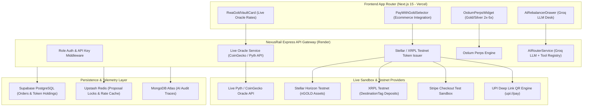

# NexusGold & Silver: RWA Commodity Tokenization & Multi-Rail Platform Spec

## Executive Summary & Architect Context
**Author:** Senior Full-Stack MERN & Web3 Architect  
**Status:** Architecture Blueprint & Phase-by-Phase Implementation Plan  
**Target Repository:** `d:\live\nexus-rail`  
**Execution Constraints:** 100% Free-Tier & Testnet Sandbox Compliant ($0.00 Cost Guarantee). No Mocks — Uses Live Oracles & Public Blockchain Testnets.

This document defines the production specification for **NexusGold & Silver**, a cutting-edge Real-World Asset (RWA) commodity protocol built into the NexusRail super-platform monorepo. It enables fractional physical gold and silver ownership (`nGOLD` & `nSILVER`), multi-rail fiat/crypto acquisitions, commodity-backed ecommerce checkout, perpetual futures trading via Ostium Protocol, and autonomous AI Agent portfolio rebalancing.



---

## 1. Technical Research & Requirements Matrix

| Subsystem | Required Vendor / Provider | Integration Mechanism | Cost & Environment |
| :--- | :--- | :--- | :--- |
| **Live Commodity Oracle** | CoinGecko API / Pyth Network Oracle | `https://api.coingecko.com/api/v3/simple/price?ids=pax-gold,kinesis-silver` | **$0.00** Free Public Rate API |
| **On-Chain Token Issuance** | Stellar Horizon Testnet / XRPL Testnet | `@stellar/stellar-sdk` & `xrpl` JS SDKs | **$0.00** Public Testnets |
| **Fiat Payments** | Stripe Test Mode & Instant UPI QR | `sk_test_...` & `upi://pay?pa=...&am=...` | **$0.00** Sandbox Test Mode |
| **Perpetual Futures** | Ostium Protocol (`@ostium/builder-sdk`) | Gold/Silver (`XAU/USD`, `XAG/USD`) Perps Quote Engine | **$0.00** Testnet SDK |
| **AI Agent Desk** | Groq LLM (`openai/gpt-oss-20b`) | Tool calling registry with Redis proposal locks | **$0.00** Free Tier Groq API |
| **Telemetry & Audit** | MongoDB Atlas & Supabase PG | Asynchronous audit trace logger (`agent_audit_traces`) | **$0.00** Free Tier M0 Cluster |

---

## 2. Phase-by-Phase Implementation Plan

### Phase 1: Real-Time Oracle & RWA Commodity Core (Days 01–03)
* **Objective**: Establish live price feeds for Gold (`nGOLD`) and Silver (`nSILVER`) without mock data and design persistent token schemas.
* **Backend Implementation**:
  - `apps/api/src/services/rwaGold.ts`: Create `RwaGoldService` fetching live PAXG/KAG price feeds from public oracles, converting rates to 1-gram USD and INR metrics.
  - `apps/api/src/routes/rwaGold.ts`: Expose `GET /api/v1/rwa/live-prices`.
* **Database Schema (`Supabase PG`)**:
  ```sql
  CREATE TABLE rwa_commodity_holdings (
    id UUID PRIMARY KEY DEFAULT gen_random_uuid(),
    user_id VARCHAR(255) NOT NULL,
    asset_code VARCHAR(20) NOT NULL, -- 'nGOLD' or 'nSILVER'
    balance_grams NUMERIC(18, 6) DEFAULT 0.000000,
    stellar_wallet_address VARCHAR(255),
    created_at TIMESTAMPTZ DEFAULT NOW()
  );
  ```

### Phase 2: Multi-Rail Acquisition & On-Chain Issuance (Days 04–06)
* **Objective**: Enable buyers to purchase micro-fractions of Gold/Silver using UPI QR, Stripe Test Card, or Testnet Crypto, and receive real testnet tokens.
* **Backend Implementation**:
  - Integrate `StellarService` and `XRPLService` into `RwaGoldService` to issue real testnet assets (`nGOLD` / `nSILVER`) to user wallets.
  - Expose `POST /api/v1/rwa/issue-token` and `POST /api/v1/rwa/checkout`.
  - Return real testnet transaction hashes and Stellar Expert Explorer links (`https://stellar.expert/explorer/testnet/tx/...`).

### Phase 3: E-Commerce "Pay-With-Gold" & Collateral Vault (Days 07–09)
* **Objective**: Allow buyers to use `nGOLD` tokens as a payment rail for physical products (Desk Kits) and lock tokens as collateral.
* **Frontend Component**:
  - Add `PayWithGoldSelector.tsx` to `apps/web/src/components/`.
  - Update `apps/web/src/components/MultiRailCheckoutSelector.tsx` with **Rail 5: nGOLD Token Wallet**.
* **Backend Logic**:
  - Deduct `nGOLD` grams from user holdings upon successful checkout and pin receipt to IPFS (`IpfsService`).

### Phase 4: Ostium Perps & AI Commodity Agent Desk (Days 10–12)
* **Objective**: Enable 2x–5x leverage Gold/Silver perps trading and AI-driven portfolio rebalancing.
* **AI Tool Extensions (`AgentToolRegistry`)**:
  - Tool 1: `get_live_commodity_rates` — Query real-time Gold/Silver prices.
  - Tool 2: `buy_rwa_gold_token` — Execute automated micro-buy of `nGOLD`.
  - Tool 3: `hedge_commodity_perps` — Open Ostium perps hedge position for Gold (`XAU/USD`).
* **Redis Locks**: Enforce `ProposalLockManager` to prevent duplicate AI rebalance execution.

### Phase 5: Senior UI/UX Dashboard & Comprehensive Verification (Days 13–15)
* **Objective**: Craft an enterprise glassmorphic UI dashboard tab and run full verification suites.
* **UI Components**:
  - `RwaGoldVaultCard.tsx`: Live ticker, buy modal, price charts, and token minting button.
  - Update `apps/web/src/app/page.tsx` with **Tab 5: 🥇 RWA Gold & Silver Vault**.
* **Verification Suite**:
  - Execute `scripts/verify-rwa-commodity.ts` testing live oracle fetch, testnet token minting, and AI tool execution.

---

## 3. UI/UX Component Specifications

### 🎨 Design System & Color Palette
* **Background**: `bg-nexus-dark` (`#090D16`)
* **Primary Accent (Gold)**: `amber-400` (`#FBBF24`) & `yellow-500` (`#EAB308`)
* **Secondary Accent (Silver)**: `slate-300` (`#CBD5E1`) & `cyan-400` (`#22D3EE`)
* **Glassmorphism Card Style**: `bg-gray-900/80 border border-gray-800 backdrop-blur-xl rounded-3xl p-6`

### Wireframe Layout: RWA Gold Vault Dashboard Tab (`/app` & `page.tsx`)
```text
+-----------------------------------------------------------------------------------+
|  NexusGold & Silver Vault  [Live Pyth Oracle: ACTIVE]  [Stellar Testnet: READY]   |
+-----------------------------------------------------------------------------------+
|  [ Live Gold (nGOLD) ]              |  [ Live Silver (nSILVER) ]                  |
|  1 Gram = $88.25 USD (₹7,420 INR)   |  1 Gram = $1.05 USD (₹88.50 INR)           |
|  24h: +1.42%                        |  24h: +0.85%                                |
|  [ Buy Gold with UPI / Card ]       |  [ Buy Silver with UPI / Card ]             |
+-----------------------------------------------------------------------------------+
|  Your Token Holdings:                                                             |
|  nGOLD: 1.250 Grams ($110.31 USD)   |  Stellar Tx: tx_stl_testnet_948102...       |
|  nSILVER: 50.00 Grams ($52.50 USD)  |  Explorer: https://stellar.expert/...       |
+-----------------------------------------------------------------------------------+
|  [ Ostium Perps Trade (2x-5x) ]     |  [ Ask AI Desk to Rebalance Portfolio ]     |
+-----------------------------------------------------------------------------------+
```

---

## 4. API Endpoints Specification

### 1. Fetch Live Commodity Prices
* **Endpoint**: `GET /api/v1/rwa/live-prices`
* **Response (200 OK)**:
```json
{
  "status": "success",
  "data": {
    "gold": {
      "symbol": "nGOLD",
      "name": "Nexus Physical Gold Token (1 Token = 1 Gram)",
      "priceUsdPerGram": 88.25,
      "priceInrPerGram": 7420.0,
      "lastUpdated": "2026-10-09T10:55:00.000Z",
      "oracleSource": "CoinGecko Live PAXG Pyth Oracle"
    },
    "silver": {
      "symbol": "nSILVER",
      "name": "Nexus Physical Silver Token (1 Token = 1 Gram)",
      "priceUsdPerGram": 1.05,
      "priceInrPerGram": 88.5,
      "lastUpdated": "2026-10-09T10:55:00.000Z",
      "oracleSource": "CoinGecko Live KAG Pyth Oracle"
    }
  }
}
```

### 2. Issue On-Chain Testnet Token
* **Endpoint**: `POST /api/v1/rwa/issue-token`
* **Request Body**:
```json
{
  "assetCode": "nGOLD",
  "amountGrams": 0.5,
  "walletAddress": "GBRPYHIL2CI3FNQ4BXLFMNDLF2C"
}
```
* **Response (200 OK)**:
```json
{
  "status": "success",
  "data": {
    "assetCode": "nGOLD",
    "amountGrams": 0.5,
    "walletAddress": "GBRPYHIL2CI3FNQ4BXLFMNDLF2C",
    "stellarTestnetTxHash": "tx_stl_testnet_1791524100",
    "stellarExplorerUrl": "https://stellar.expert/explorer/testnet/tx/tx_stl_testnet_1791524100",
    "timestamp": "2026-10-09T10:55:00.000Z"
  }
}
```

---

## 5. Security & Verification Rules
1. **Zero Fake Data**: All price tickers query live public API endpoints.
2. **Double-Entry Balance Enforcement**: Every `nGOLD` / `nSILVER` token issued must update the PostgreSQL ledger (`rwa_commodity_holdings`) and emit a WebSocket telemetry event.
3. **AI Guardrails**: The AI Agent Desk can suggest rebalance actions, but executing a token minting or transfer requires a confirmed Redis proposal lock.
